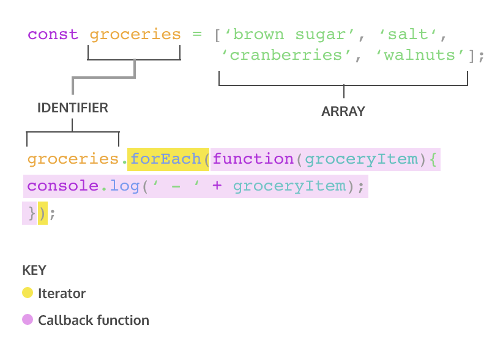

# Iterators

* [Introduction to Iterators](#Introduction-to-Iterators)
* [The .forEach() Method](#The-.forEach()-Method)
* [The .map() Method](#The-.map()-Method)


## Introduction to Iterators
The built-in JavaScript array methods that help us iterate are called *iteration methods*, at times referred to as *iterators*.

Iterators are methods called in arrays to manipulate elements and return values.

## The .forEach() Method
The first iteration method is `.forEach()`. `.forEach()` will execute the same code for each element of an array.



+ `groceries.forEach()` calls the `forEach` method on the `groceries` array.
+ `.forEach()` takes an argument of callback function. Remember, a callback function is a function passed as an argument into another function.
+ `.forEach()` loops through the array and executes the callback function for each element. During each execution, the current element is passed as an argument to the callback function.
+ The return value for `.forEach()` will always be `undefined`.

Another way to pass a callback for `.forEach()` is using arrow function syntax.
```js
groceries.forEach(groceryItem => console.log(groceryItem));
```

We can also define a function beforehand to be used as the callback function.
```js
function printGrocery(element) {
  console.log(element);
}

groceries.forEach(printGrocery);
```

`.forEach()` example:
```js
const fruits = ['mango', 'papaya', 'pineapple', 'apple'];

fruits.forEach(fruit => {
  console.log('I want to eat a ' + fruit);
});
```

Output:
```js
I want to eat a mango
I want to eat a papaya
I want to eat a pineapple
I want to eat a apple
```

## The .map() Method
When `.mao()` is called on an array, it takes an argument of a callback function and returns a new array.

```js
const numbers = [1, 2, 3, 4, 5];

const bigNumbers = numbers.map(number => {
  return number * 10;
});

console.log(numbers); // Output: [1, 2, 3, 4, 5]
console.log(bigNumbers); // Output: [10, 20, 30, 40, 50]
```

`.map()` returns a new array.

+ `bigNumbers` will store the return value of calling `.map()` on `numbers`.
+ `numbers.map` will iterate through each element in the `numbers` array and pass the element into the callback function.
+ `return number * 10` is the code we wish to execute upon each element in the array. This will save each value from the `numbers` array, multiplied by `10`, to a new array.